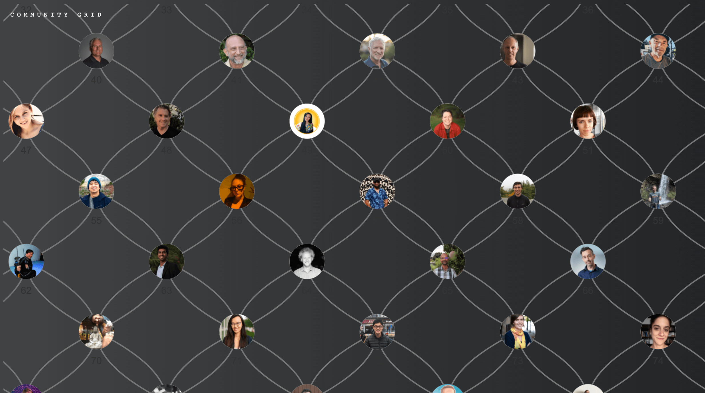

# community-grid

**Live demo:** [https://tairea.github.io/community-grid](https://tairea.github.io/community-grid)

This concept came out of a conversation I had at [DwebCamp2022](https://dwebcamp.org/people/).

The idea being that all conference or community participants could enter their interests and projects before physically meeting up and the Community Grid A.I. would recommend 4 people each participant should meet based on the info they provided.

Kind of like an A.I. generated human scavenger hunt for conferences.

The A.I. recommendation part hasn't been built yet because I'm not that smart.

If you have some ideas of the logic to match 4 connections for each participant based on their inputs, and place them accordingly in this constrained grid format, hit me up (Discord: vai-ian#0058).

